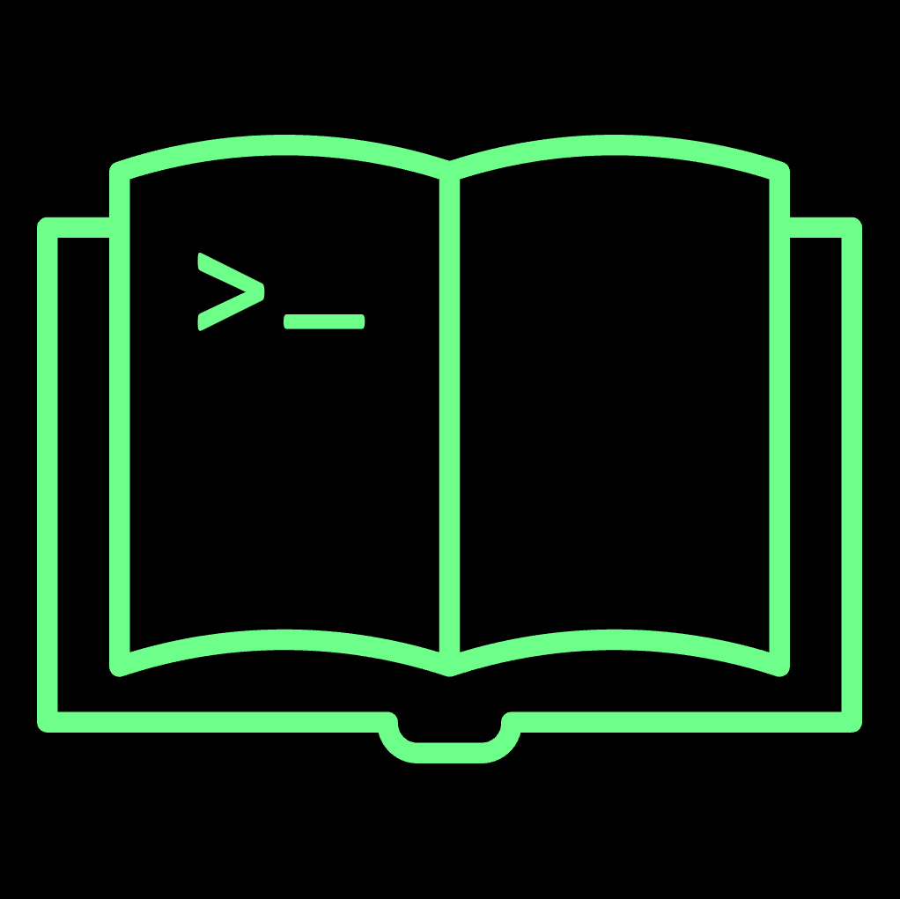

# Playbooks MCP 

**MCP server that exposes [OpenMono Playbooks](https://github.com/StartupHakk/OpenMonoAgent.ai) — typed, multi-step AI workflows with human-in-the-loop gates, checkpointing, and composability — to any MCP-compatible agent.**

> Inspired by and derived from the [OpenMonoAgent.ai](https://github.com/StartupHakk/OpenMonoAgent.ai) playbook engine. See [ATTRIBUTION.md](ATTRIBUTION.md).

---

## What Are Playbooks?

Playbooks are **declarative, versioned, multi-step AI workflows** encoded as YAML+Markdown files (`PLAYBOOK.md`). They enable repeatable software engineering processes — commits, releases, code reviews, deployments, incident response — to be executed by an AI agent with precise control over tool access, human checkpoints, parameter validation, step ordering, and fault tolerance via checkpoint/resume.

### A Playbook at a Glance

```yaml
---
name: commit
version: 1.0.0
description: Inspect staged changes, generate a conventional commit message, and commit.
trigger: auto
trigger-patterns:
  - "commit *"
parameters:
  scope:
    type: String
    required: false
    hint: "Conventional commit scope (e.g. auth, ui, api)"
  message:
    type: String
    required: false
    hint: "Override the generated commit message subject line"
allowed-tools:
  - "*"
context-mode: Selective
tags:
  - git
  - workflow
---
You are a Git commit assistant. Your job is to:
1. Run `git status` and `git diff --staged` to understand what is staged...
2. Analyse the diff and write a concise conventional commit message...
3. Run `git commit -m "<message>"`...
```

## How It Compares

|                       | Playbooks                              | Skills (Claude Code)  | MCP Servers              |
| --------------------- | -------------------------------------- | --------------------- | ------------------------ |
| **What it is**        | Workflow orchestration engine          | Instruction injection | Tool/capability provider |
| **Format**            | YAML frontmatter + Markdown body       | Plain Markdown        | Code (various languages) |
| **Parameters**        | Typed, validated, defaults, enums      | None                  | Defined per tool         |
| **Multi-step**        | ✅ DAG with dependencies               | ❌ Single-shot        | ❌ Per-tool              |
| **Human gates**       | ✅ 4 levels (Confirm, Review, Approve) | ❌                    | ❌                       |
| **Checkpoint/resume** | ✅ After every step                    | ❌                    | ❌                       |
| **Composability**     | ✅ Playbooks call playbooks            | ❌                    | ❌ (servers can compose) |
| **State**             | Named outputs, persisted to disk       | Stateless             | Optional server-side     |

**Playbooks absorb the Skill layer entirely.** A Skill (`"You are a git commit assistant..."`) is just a Playbook with zero steps, zero parameters, and zero gates — the Markdown body _is_ the system prompt. Playbooks are a strict superset.

Playbooks and MCP are **complementary**: MCP provides tools, Playbooks orchestrate their use across multi-step workflows with safety gates.

```
┌───────────────────────────────────────────────┐
│  PLAYBOOKS                                    │
│  "What to do, in what order, with what checks"│
│  (Workflow orchestration layer)               │
├───────────────────────────────────────────────┤
│  TOOLS + MCP                                  │
│  "What capabilities are available"            │
│  (Capability layer)                           │
└───────────────────────────────────────────────┘
```

## MCP Server Tools

This server exposes the following tools to any MCP-compatible agent:

| Tool                 | Description                                                                     |
| -------------------- | ------------------------------------------------------------------------------- |
| `list_playbooks`     | Discover all available playbooks with names, descriptions, parameters, and tags |
| `run_playbook`       | Execute a playbook by name with typed parameters; streams step-by-step status   |
| `resume_playbook`    | Resume an interrupted playbook from its last checkpoint                         |
| `get_playbook_state` | Inspect current or final state of a playbook run                                |
| `validate_playbook`  | Dry-run validation — check syntax, parameters, and step dependencies            |

## Quick Start

### Prerequisites

- Node.js >= 18
- An MCP-compatible agent (Claude Desktop, Cline, Continue, etc.)

### Installation

```bash
# Clone this repo
git clone https://github.com/davidrsch/playbooks-mcp.git
cd playbooks-mcp

# Install dependencies
npm install

# Build
npm run build
```

### Configure Your Agent

Add to your MCP agent's configuration (e.g., `cline_mcp_settings.json` or `claude_desktop_config.json`):

```json
{
  "mcpServers": {
    "playbooks-mcp": {
      "command": "node",
      "args": ["path/to/playbooks-mcp/dist/index.js"],
      "env": {
        "PLAYBOOKS_PATH": "~/.openmono/playbooks"
      }
    }
  }
}
```

### Add Playbooks

Create a `.openmono/playbooks/` directory in your project or home directory, then add playbook subdirectories:

```
.openmono/playbooks/
├── commit/
│   └── PLAYBOOK.md
├── release/
│   ├── PLAYBOOK.md
│   ├── scripts/
│   │   ├── pre-flight.sh
│   │   ├── validate-tests.sh
│   │   └── tag-and-push.sh
│   └── steps/
│       ├── 01-analyze.md
│       ├── 02-changelog.md
│       └── 03-version.md
└── incident-response/
    └── PLAYBOOK.md
```

See the [How to Create Playbooks](docs/HOW-TO-CREATE-PLAYBOOKS.md) guide and [Playbook Reference](docs/PLAYBOOKS.md) for the full specification.

## Documentation

- **[What Are Playbooks?](docs/PLAYBOOKS.md)** — Full reference: format, all fields, template variables, gates, state, discovery
- **[How to Create Playbooks](docs/HOW-TO-CREATE-PLAYBOOKS.md)** — Step-by-step guide from zero to a working playbook
- **[Example Playbooks](docs/PLAYBOOKS-EXAMPLES.md)** — Annotated examples: commit, release, file-scan, pr-ready, db-migrate, deploy-ftp, incident-response
- **[Playbooks vs. Skills vs. MCP](docs/COMPARISON.md)** — Detailed comparison of the three concepts
- **[ATTRIBUTION](ATTRIBUTION.md)** — Attribution to the original project

## Playbook Features

- ✅ **Typed parameters** — String, Number, Boolean, Array with validation, defaults, enums, min/max
- ✅ **Multi-step DAG** — Steps with `requires` dependencies, topologically sorted
- ✅ **Human gates** — `Confirm` (y/N), `Review` (inspect output), `Approve` (full preview)
- ✅ **Named step outputs** — `{{state.<key>}}` for downstream step consumption
- ✅ **Shell integration** — Shell scripts as step validators; live `{{shell:<cmd>}}` resolution
- ✅ **Template variables** — `{{params.<name>}}`, `{{state.<key>}}`, `{{shell:<cmd>}}`, `{{file:<path>}}`, `{{env.*}}`
- ✅ **Sub-playbook composition** — One playbook can invoke another via `playbook:` field on a step
- ✅ **Sub-agent delegation** — Steps can run under a specific agent with filtered tool sets
- ✅ **Checkpoint/resume** — State persisted after every step; resume from last completed
- ✅ **Pattern-based auto-trigger** — Wildcard matching with scoring
- ✅ **Constraint injection** — Safety guardrails merged into every step context
- ✅ **Context modes** — `Full`, `Selective`, or `Fork` per playbook
- ✅ **SemVer versioning** — Tracked and validated

## License

MIT — see [LICENSE](LICENSE).

## Attribution

This project is inspired by and derives its playbook engine from [OpenMonoAgent.ai](https://github.com/StartupHakk/OpenMonoAgent.ai) by StartupHakk. See [ATTRIBUTION.md](ATTRIBUTION.md) for full details.
